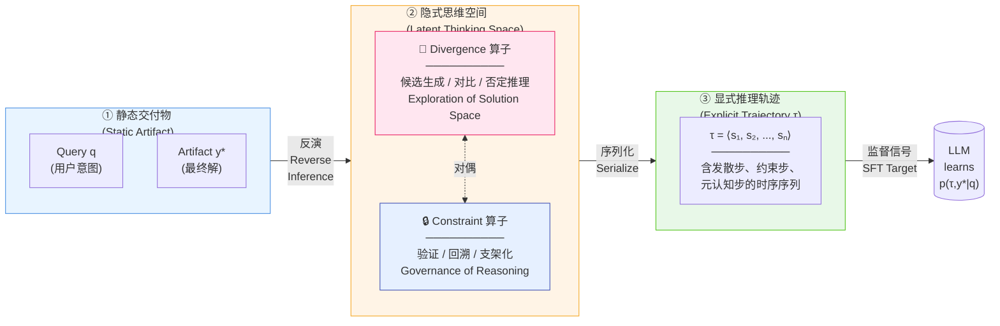
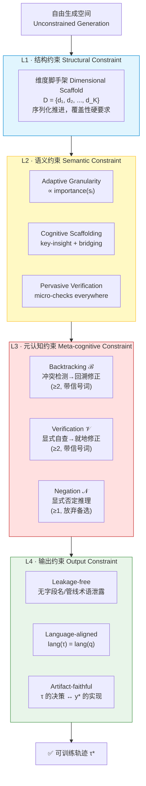
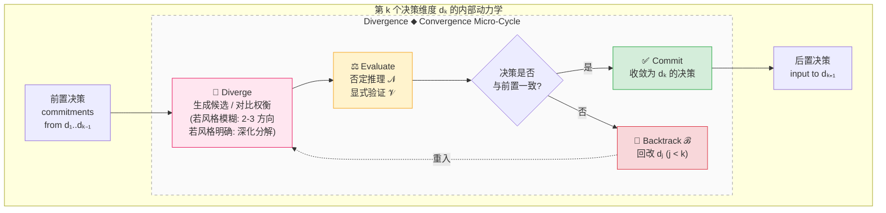
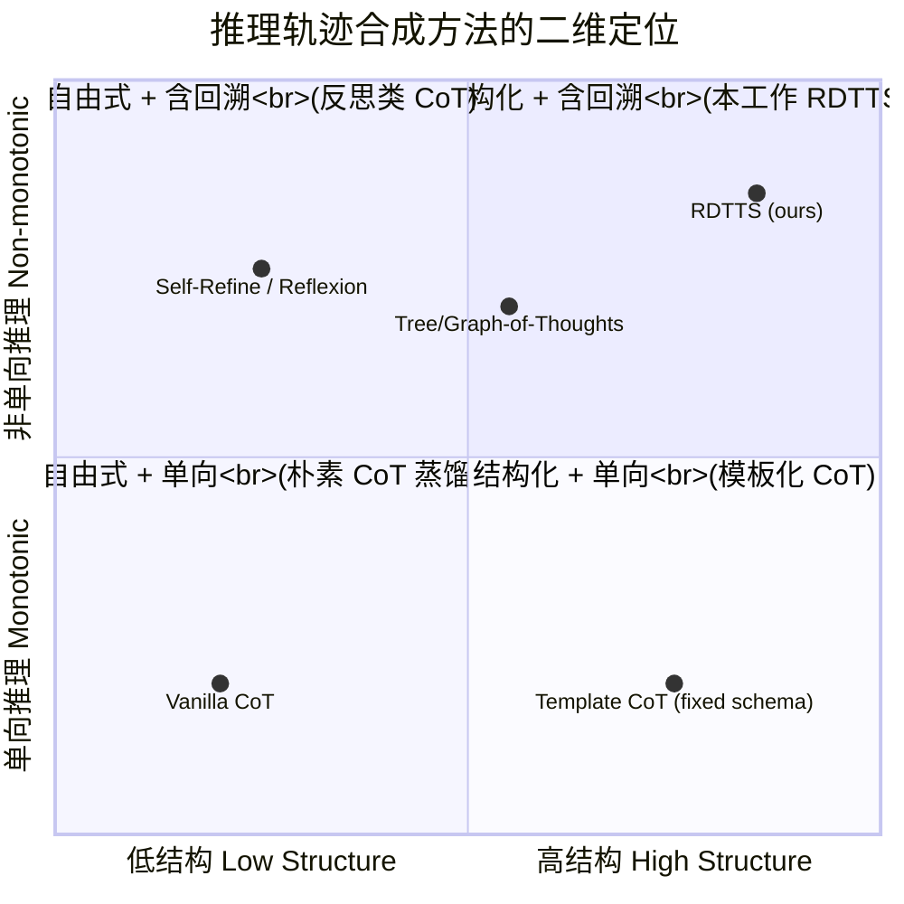

# RDTTS 方法论抽象：面向论文的发散-约束对偶框架

> 本文档将 `slow-think-long-chain-v4-421` 技能从具体实现（11 维度 × Web 设计）抽象为通用方法论，核心框架是 **Divergence-Constraint Duality（发散-约束对偶）** 驱动的 **Reverse Design-Thinking Trajectory Synthesis（RDTTS）**。

---

## 图 1 · 顶层概念框架：发散-约束对偶下的设计思维轨迹反演

**形式化表述（可直接放入论文）：**

> 给定静态三元组 $(q, y^*, \mathcal{D})$，其中 $q$ 为用户查询、$y^*$ 为专家设计交付物、$\mathcal{D}$ 为过程文档。RDTTS 的目标是合成一条显式推理轨迹 $\tau$，使得学习目标从 $p(y^* \mid q)$ 扩展为 $p(\tau, y^* \mid q)$，其中 $\tau$ 必须同时满足**发散覆盖性（divergent coverage）**与**约束一致性（constraint consistency）**。

---

## 图 2 · 四层约束架构：从自由生成到可训练轨迹的层级规约

**论文语言版表述：**

| 约束层 | 形式化描述 | 方法论意义 |
|---|---|---|
| **L1 Structural** | $\tau$ 必须覆盖预设维度集 $D$，且遵循偏序 $\prec_D$ | 保证**思维广度**——不跳过关键决策面 |
| **L2 Semantic** | 每个推理步 $s_i$ 的长度、理由密度、自查密度满足函数约束 | 保证**思维质地**——不平铺、不跳理由、不无自查 |
| **L3 Meta-cognitive** | $\tau$ 中显式包含 $\mathcal{B}$、$\mathcal{V}$、$\mathcal{N}$ 三类带信号词的认知算子 | 保证**思维迭代性**——体现探索-评估-修正循环 |
| **L4 Output** | $\tau$ 对 $\mathcal{D}$ 不可逆（无溯源泄露）且对 $y^*$ 可兑现 | 保证**可训练性与泛化性** |

---

## 图 3 · 过程模型：每个决策维度上的微型 Double-Diamond

**核心论点（paper claim）：**

> 传统 CoT 数据假设推理是**单调前向（monotonic forward）**的；本方法显式引入**非单调性（non-monotonicity）**——即 $\mathcal{B}$ 算子允许 $\tau$ 回写已提交的决策 $d_j$，从而将设计思维的"探索-评估-修正-迭代"循环编码进训练信号。

---

## 图 4 · 方法论在连续谱上的定位（可作为 Related Work 对照图）

---

## 论文表述建议（可直接改写入 Methodology 章）

本方法可概括为一个**四元组 $\langle D, \Phi, \Omega, \Gamma \rangle$**：

- **$D$（Dimensional Schema）**：领域先验的决策维度集合，定义思维空间的**坐标轴**
- **$\Phi$（Semantic Principles）**：作用于推理文本的连续约束，定义思维的**质地函数**
- **$\Omega$（Meta-cognitive Operators）** = $\{\mathcal{B}, \mathcal{V}, \mathcal{N}\}$：定义思维的**动力学算子**
- **$\Gamma$（Output Gates）**：对最终轨迹的离散硬约束，定义样本的**可训练边界**

合成过程即为在 $(D \times \Phi)$ 的受约束轨迹空间中，以 $\Omega$ 为推进算子、以 $\Gamma$ 为终止判据，反演出一条从 $q$ 到 $y^*$ 的**既发散又自洽**的思维路径 $\tau^*$：

$$
\tau^* = \arg\max_{\tau} \; p(\tau, y^* \mid q) \quad \text{s.t.} \quad \tau \vDash D \wedge \Phi \wedge \Omega \wedge \Gamma
$$

---

## 三个关键学术贡献点（建议作为论文 Contribution 列表）

1. **显式建模非单调推理（Explicit Non-monotonic Reasoning）**——将 Backtracking 提升为一等公民的认知算子，而非隐式在错误样本中体现
2. **分层约束治理（Hierarchical Constraint Governance）**——L1–L4 的正交约束分解，使"推理质量"成为可审计、可量化的训练目标
3. **发散-约束对偶（Divergence-Constraint Duality）**——首次将设计思维的双钻石模型形式化为可用于 SFT 数据合成的算子对
