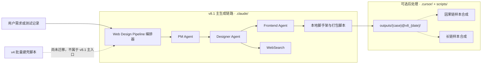
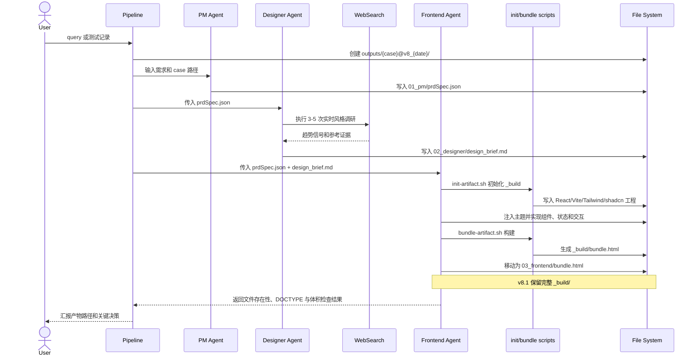
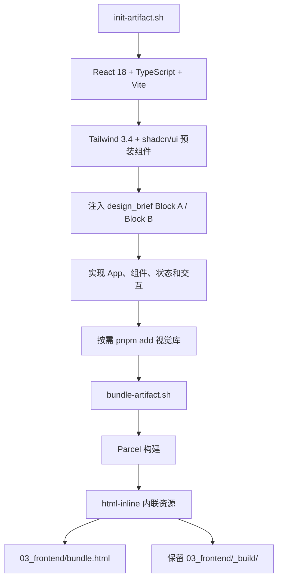
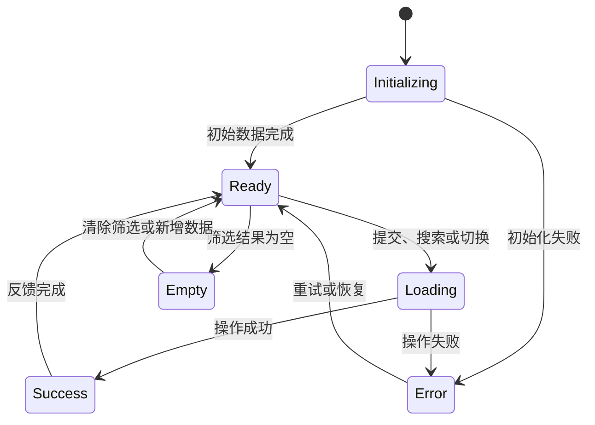
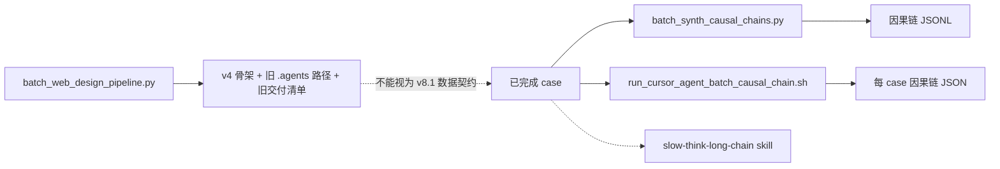

# Web Design Pipeline v8.1 Architecture

本文描述当前 `.claude/` 主流程的真实架构，并把 `.cursor/` 与 `scripts/` 中尚未迁移的旧版工具明确隔离。当前主流程不是旧文档中的 `.agents/skills/` v4 多产物架构。

## 1. 系统边界



主链路只负责生成网站/App case。慢思考数据合成是读取已完成 case 的后处理流程，不参与页面生成。

## 2. 组件与职责

| 组件 | 位置 | 读取 | 写入 | 责任边界 |
| --- | --- | --- | --- | --- |
| Pipeline 编排规则 | `.claude/skills/web-design-pipeline/SKILL.md` | 用户输入、输出规范 | case 目录与元数据 | 控制三阶段顺序、命名和交付纪律 |
| PM Agent | `.claude/agents/pm-agent.md` | query/测试记录 | `01_pm/prdSpec.json` | 把需求压缩为固定 Schema，不负责视觉实现 |
| Designer Agent | `.claude/agents/designer-agent.md` | `prdSpec.json`、设计约束、WebSearch 结果 | `02_designer/design_brief.md` | 把需求转成可执行设计系统，不写前端代码 |
| Frontend Agent | `.claude/agents/frontend-agent.md` | `prdSpec.json`、`design_brief.md`、工程约束 | `_build/`、`bundle.html` | 实现功能与交互，完成构建和归档 |
| 初始化脚本 | `.claude/skills/web-design-pipeline/scripts/init-artifact.sh` | 目标 `_build` 路径、shadcn 预包 | React/Vite/Tailwind/shadcn 工程 | 创建一致的工程基线 |
| 打包脚本 | `.claude/skills/web-design-pipeline/scripts/bundle-artifact.sh` | `_build` 工程 | `_build/bundle.html` | Parcel 构建并通过 `html-inline` 内联资源 |
| 设计约束 | `references/design-guardrails.md` | 产品和视觉需求 | Designer 决策约束 | 防止模板化、不可读和不可用的设计 |
| 工程约束 | `references/engineering-guardrails.md` | 设计规范和源码 | Frontend 实现约束 | 固定技术栈、模块兼容、文件协议和体积要求 |
| 输出规范 | `references/output-structure.md` | 管线版本 | case 目录结构 | 当前 v8.1 归档事实来源 |

表中 `references/` 均位于 `.claude/skills/web-design-pipeline/` 下。

## 3. 数据契约

### 3.1 输入

流水线接受两类输入：

- 自然语言 query。
- 测试记录；需求文本为必需信息，`id`、`domain`、`user_req` 等字段用于命名和上下文补全。

只有缺失信息会造成实质性架构分叉时，才在 PM 阶段前向用户提问。

### 3.2 PM → Designer/Frontend

`prdSpec.json` 固定包含 11 个字段，字段名不可新增、删除或重命名：

```text
user_intent
target_user
usage_context
platform
page_type
primary_task
secondary_tasks
functional_requirements
visual_requirements
interaction_requirements
implicit_requirements
```

Designer 主要消费视觉、交互、用户与场景字段；Frontend 把 `functional_requirements` 与 `implicit_requirements` 作为验收红线。

### 3.3 Designer → Frontend

`design_brief.md` 是单一设计契约，至少包含：

- 设计问题陈述与 WebSearch 趋势证据。
- 视觉主题、色彩角色、排版、间距、层级和响应式策略。
- 核心组件样式、状态和 shadcn 映射。
- 页面交互清单、动效节奏和降级策略。
- Tailwind Block A：`src/index.css` 的 shadcn HSL CSS 变量。
- Tailwind Block B：`tailwind.config.js` 的 `theme.extend`。

Frontend 不应重新发明设计系统，而应把这份契约直接映射到工程。

### 3.4 Frontend → 使用者

`bundle.html` 是唯一最终前端交付：

- 自包含 HTML、CSS、JavaScript 和 npm 依赖。
- Google Fonts 可以保持外链。
- 必须支持 `file://` 直接打开。
- 目标体积小于 5 MB。

`_build/` 是保留的工程源码与依赖缓存，用于审查和迭代，不改变 `bundle.html` 的最终交付地位。

## 4. 单次执行时序



Designer 必须先取得真实 WebSearch 结果再写设计结论。Frontend 直接执行构建，不在 Agent 内通过 dev server 或浏览器工具进行反复验收，以避免无终止循环。

## 5. 前端构建链路



工程约束：

- 禁止 Tailwind CDN 和运行时 `tailwind.config = {}` 字面量。
- 主题由 shadcn HSL CSS 变量与 `theme.extend` 共同驱动。
- 第三方库使用 npm 依赖，不通过 CDN 引入。
- `main.tsx` 必须使用 Root Error Boundary 包裹 `<App />`。
- 浏览器通过 `file://` 加载时不得依赖服务端路由、运行时模块请求或开发服务器。
- v8.1 禁用 p5.js；需要粒子、噪声或生成纹理时使用兼容 Parcel 和单文件加载的替代实现。

## 6. 状态与交互模型

页面被视为有状态的交互系统，而不是静态截图集合。Frontend 至少需要覆盖与需求相关的这些状态转换：



具体实现由 `prdSpec.json` 和 `design_brief.md` 决定，但导航、筛选、排序、表单校验、组件联动、加载、空状态、错误恢复和过渡动画不能只保留视觉外壳。

## 7. 归档结构与生命周期

```text
outputs/{case_id}@v8_{YYYYMMDD}/
├── meta.json
├── 01_pm/
│   └── prdSpec.json
├── 02_designer/
│   └── design_brief.md
└── 03_frontend/
    ├── bundle.html
    └── _build/
        ├── package.json
        ├── tailwind.config.js
        ├── postcss.config.js
        ├── tsconfig.json
        ├── vite.config.ts
        ├── index.html
        ├── node_modules/
        └── src/
```

生命周期规则：

1. Pipeline 创建 case 目录和三个阶段目录。
2. 每个 Agent 只写自己的阶段目录，下游通过文件契约读取上游结果。
3. `bundle.html` 构建成功后从 `_build/` 移到 `03_frontend/` 一级。
4. `_build/` 和其中的 `node_modules/` 默认保留；磁盘紧张时可由用户手动删除 `node_modules/`。
5. 删除依赖后可在 `_build/` 运行 `pnpm install` 恢复开发环境。

## 8. 后处理与遗留边界



边界判断：

- `.cursor/skills/slow-think-*` 是训练数据合成规范，不是页面生成 Agent。
- `batch_synth_causal_chains.py` 能递归读取部分 v8.1 `_build/src` 文件，但其提示规范仍含旧产物字段，不能据此推断已经完成 v8.1 迁移。
- `batch_web_design_pipeline.py` 当前默认 `--pipeline-version 4`，并生成 `.agents/skills/web-design-pipeline/...` 路径及 `prd.md`、多份 Designer JSON、`tech_decision.json` 等旧交付清单。
- 在脚本迁移完成前，v8.1 的可靠入口是 `.claude/skills/web-design-pipeline/SKILL.md` 驱动的 Agent 流程。

## 9. 规则优先级与冲突

当前仓库存在版本迁移未完全收尾的问题。执行时采用以下优先级：

1. `references/output-structure.md`：v8.1 目录和保留策略。
2. `frontend-agent.md` + `references/engineering-guardrails.md`：当前实现行为。
3. `SKILL.md`：顶层编排意图。
4. 根目录 `scripts/`：尚未迁移的批处理行为。

已确认的冲突：

| 冲突点 | 旧描述 | 当前 v8.1 口径 |
| --- | --- | --- |
| 版本元数据 | `SKILL.md` front matter 仍为 `version: 8.0` | `CHANGELOG.md`、`output-structure.md` 为 v8.1 |
| `_build/` 生命周期 | `SKILL.md` 部分段落要求删除 | `output-structure.md`、`frontend-agent.md` 要求保留 |
| p5.js | `SKILL.md` 仍列为可选 npm 包 | v8.1 输出与工程规范禁用 |
| 批量建壳 | v4 默认值与 `.agents` 路径 | 主实现位于 `.claude`，输出契约为三份核心文件 |
| 慢思考输入 | 依赖旧版多文件产物 | v8.1 核心产物已收敛，需适配后再作为稳定工具 |

这份架构文档描述当前可执行口径，但不把上述代码和规则冲突伪装成已修复。

## 10. 变更落点

| 变更目标 | 应修改的位置 |
| --- | --- |
| 调整顶层流程或适用场景 | `.claude/skills/web-design-pipeline/SKILL.md` |
| 修改需求 Schema | `.claude/agents/pm-agent.md`，并同步 Designer/Frontend 消费规则 |
| 修改设计交付格式 | `.claude/agents/designer-agent.md` 与 `design-guardrails.md` |
| 修改前端栈或打包方式 | `.claude/agents/frontend-agent.md`、`engineering-guardrails.md` 与两个本地脚本 |
| 修改 case 目录或保留策略 | `references/output-structure.md`，再同步所有 Agent 和辅助脚本 |
| 升级管线版本 | `SKILL.md`、`CHANGELOG.md`、`output-structure.md`、Agent 描述和批处理脚本同时更新 |
| 适配 v8.1 训练数据合成 | `.cursor/skills/slow-think-*` 与 `scripts/batch_synth_causal_chains.py` |
