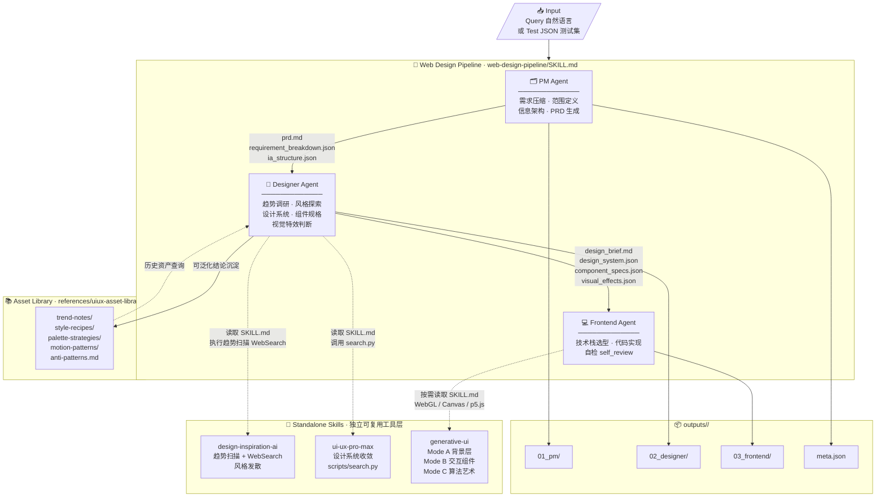
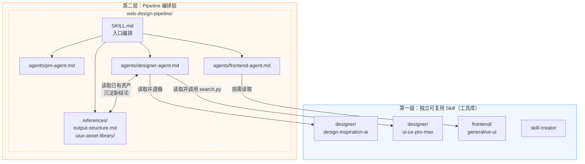
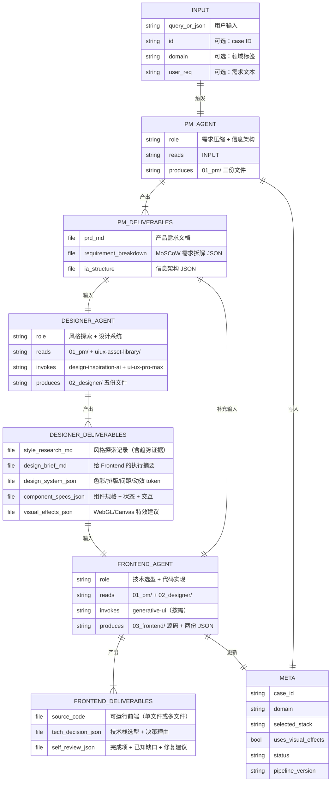
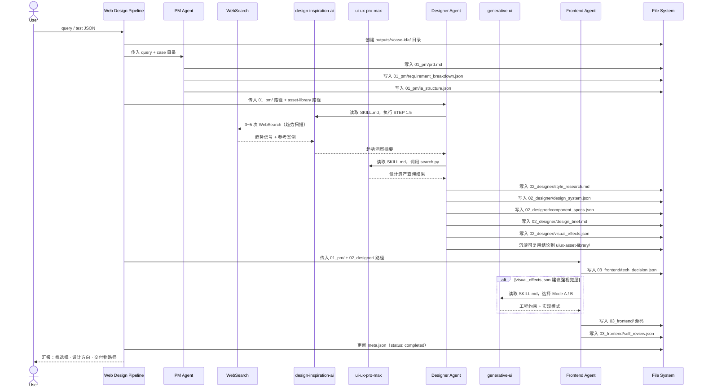
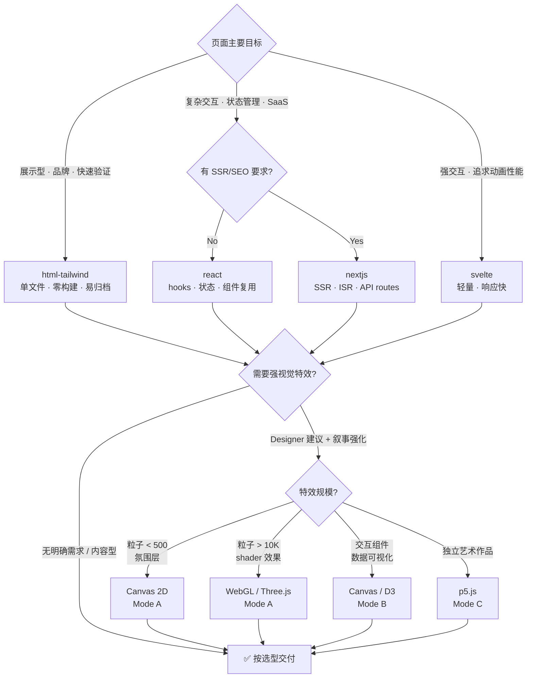

# Architecture

UI Data Synth Pipeline 的整体架构、Agent 实体关系与数据流文档。

---

## 1. 端到端流水线总览

从一条 query 或测试 JSON 出发，经三个 Agent 阶段，产出可运行前端与完整过程数据。



---

## 2. Skill 层级与调用依赖

两层结构：独立工具 + pipeline 编排。



---

## 3. Agent 实体关系与交付物

每个 Agent 的输入、输出与外部依赖。



---

## 4. 单次执行数据流（时序）

一个 case 从触发到归档的完整时序。



---

## 5. 输出目录结构

每个 case 的标准归档格式。

```
outputs/
└── <case-id>/                        # 如 001_devtools 或 20260312_143022_habit-tracker
    ├── meta.json                     # case 元数据（栈、域、状态、pipeline 版本）
    │
    ├── 01_pm/
    │   ├── prd.md                    # 产品需求文档（面向下游 agent）
    │   ├── requirement_breakdown.json  # MoSCoW 需求拆解
    │   └── ia_structure.json         # 信息架构（页面结构 + 用户流）
    │
    ├── 02_designer/
    │   ├── style_research.md         # 趋势调研 + 3 方向探索 + 最终选型
    │   ├── design_brief.md           # 给 Frontend 的执行摘要
    │   ├── design_system.json        # 色彩 / 排版 / 间距 / 动效 token
    │   ├── component_specs.json      # 组件清单 + 状态 + 交互规范
    │   └── visual_effects.json       # WebGL / Canvas 特效建议与理由
    │
    └── 03_frontend/
        ├── index.html                # html-tailwind 栈交付物
        ├── src/                      # react / vue / svelte 等多文件栈
        ├── tech_decision.json        # 技术决策 + 选型理由
        └── self_review.json          # 完成项 · 已知缺口 · 修复候选

.agents/skills/references/uiux-asset-library/
    ├── trend-notes/                  # 跨 case 趋势观察
    ├── style-recipes/                # 可复用风格配方（如 devtools-precision-console.md）
    ├── palette-strategies/           # 配色策略
    ├── motion-patterns/              # 动效模式
    └── anti-patterns.md             # 同质化风险清单
```

---

## 6. 技术栈选型决策树

Frontend Agent 在 `tech_decision.json` 中做出的核心判断。



---

## 迭代说明

| 扩展点 | 操作 |
|--------|------|
| 增加新的独立工具 | 在 `.agents/skills/designer/` 或 `.agents/skills/frontend/` 下新建目录 |
| 调整 Pipeline 某阶段行为 | 修改 `.agents/skills/web-design-pipeline/agents/<agent>.md` |
| 增加输出格式 | 更新 `references/output-structure.md` + 对应 agent prompt |
| 沉淀设计资产 | 直接写入 `references/uiux-asset-library/` 对应子目录 |
| 调整技术栈选型逻辑 | 修改 `frontend-agent.md` 的选型建议部分 |
