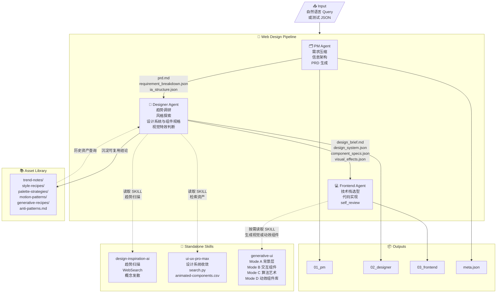
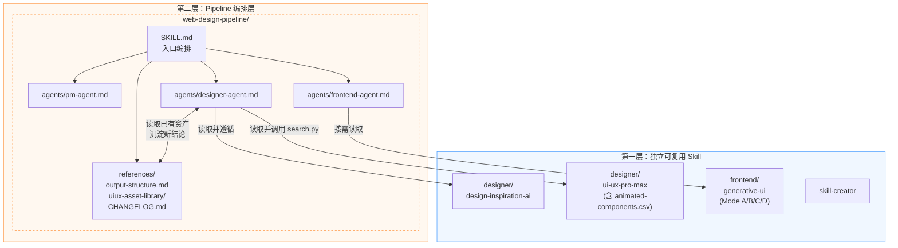
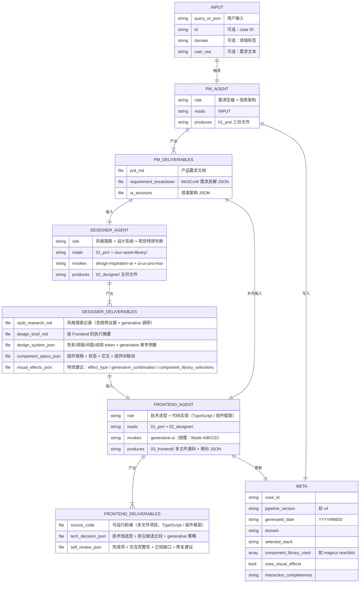
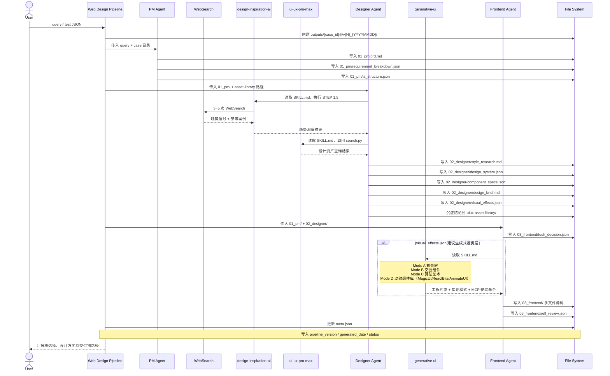
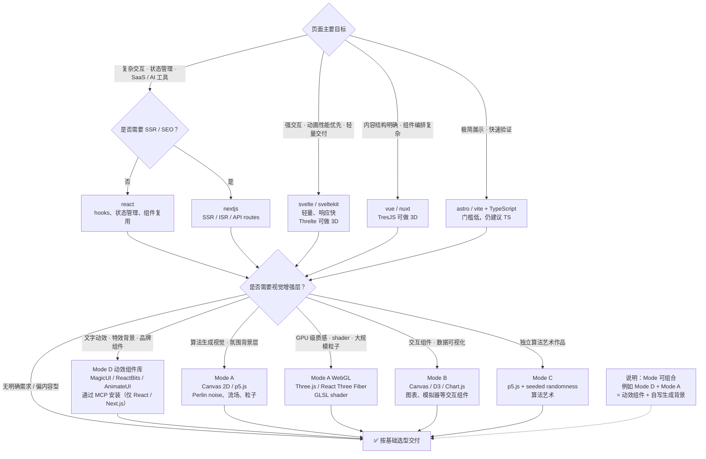

# Architecture

UI Data Synth Pipeline 的整体架构、Agent 实体关系与数据流文档。

---

## 1. 端到端流水线总览

从一条 query 或测试 JSON 出发，经 `PM -> Designer -> Frontend` 三阶段，产出可运行前端与完整过程数据。



---

## 2. Skill 层级与调用依赖

两层结构：上层是独立工具库，下层是 pipeline 编排层。



---

## 3. Agent 实体关系与交付物

这一层强调每个 Agent 的输入、输出与外部依赖。



---

## 4. 单次执行数据流（时序）

下图展示单个 case 从触发到归档的完整时序。



---

## 5. 输出目录结构

每个 case 的标准归档格式如下（`v4` 起）。

```text
outputs/
├── v1-pipeline/                       # v1 历史存档（只读）
├── v2-pipeline/                       # v2 历史存档（只读）
├── v3-pipeline/                       # v3 历史存档（只读）
└── {case_id}@v{N}_{YYYYMMDD}/         # v4 起，如 010_meeting-collab@v4_20260315
    ├── meta.json                      # case 元数据：版本、日期、域、技术栈、状态
    │
    ├── 01_pm/
    │   ├── prd.md                     # 产品需求文档（面向下游 agent）
    │   ├── requirement_breakdown.json # MoSCoW 需求拆解
    │   └── ia_structure.json          # 信息架构（页面结构 + 用户流）
    │
    ├── 02_designer/
    │   ├── style_research.md          # 趋势调研、generative 调研、方向探索、最终选型
    │   ├── design_brief.md            # 给 Frontend 的执行摘要（含组件联动清单）
    │   ├── design_system.json         # 色彩、排版、间距、动效 token + generative 参数
    │   ├── component_specs.json       # 组件清单、状态、交互规范、组件间联动
    │   └── visual_effects.json        # 特效建议与组件库选择
    │
    └── 03_frontend/
        ├── [框架惯用结构]/             # 多文件项目，按所选框架自由组织
        ├── src/generative/            # Canvas / WebGL / p5.js / Three.js 模块
        ├── tech_decision.json         # 技术决策、前沿候选比较、generative 策略
        └── self_review.json           # 完成项、交互完整性、已知缺口、修复候选

.agents/skills/web-design-pipeline/references/uiux-asset-library/
├── trend-notes/                       # 跨 case 趋势观察
├── style-recipes/                     # 可复用风格配方
├── palette-strategies/                # 配色策略
├── motion-patterns/                   # 动效模式
├── generative-recipes/                # generative 视觉与代码艺术组合策略
└── anti-patterns.md                   # 同质化风险清单
```

---

## 6. 技术栈选型决策树

这是 Frontend Agent 在 `tech_decision.json` 中做出的核心判断。本项目以视觉品质优先，不按实现成本排序。



---

## 7. 管线版本与迭代

| 版本 | 日期 | 主要变更 |
|------|------|----------|
| v1 | 2026 早期 | 基本流水线，单阶段生成，测试集批量跑通 |
| v2 | 2026 早期 | 三阶段流水线（PM → Designer → Frontend），uiux-asset-library 资产沉淀 |
| v3 | 2026 早期 | generative-ui skill，强制多文件 TS 交付，禁纯静态 HTML，视觉品质门槛 |
| **v4** | **2026-03-15** | **动效组件库层（Mode D）+ MCP 集成 + 输出目录命名规范 + 结构模板解放** |

详细变更记录见：`.agents/skills/web-design-pipeline/CHANGELOG.md`

| 扩展点 | 操作 |
|--------|------|
| 增加新的独立工具 | 在 `.agents/skills/designer/` 或 `.agents/skills/frontend/` 下新建目录 |
| 调整 Pipeline 某阶段行为 | 修改 `.agents/skills/web-design-pipeline/agents/<agent>.md` |
| 增加输出格式 | 更新 `references/output-structure.md` + 对应 agent prompt |
| 沉淀设计资产 | 直接写入 `references/uiux-asset-library/` 对应子目录 |
| 调整技术栈选型逻辑 | 修改 `frontend-agent.md` 的选型建议部分 |
| 管线版本升级 | 更新 `SKILL.md` 版本号 + `output-structure.md` 命名格式 + 追加 `CHANGELOG.md` |
