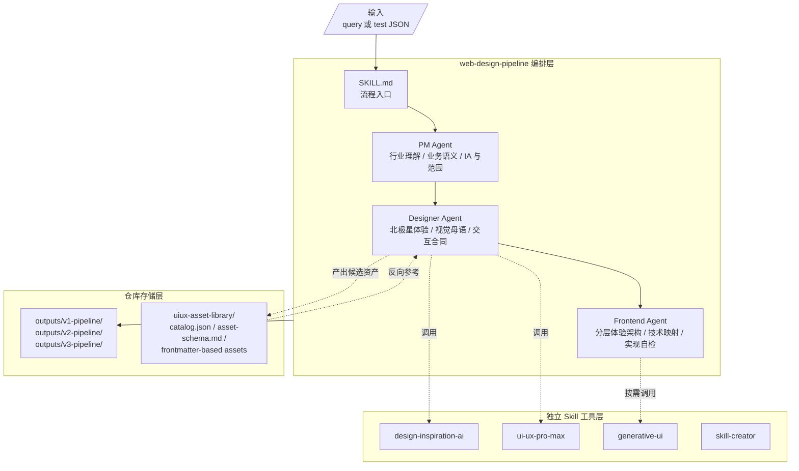
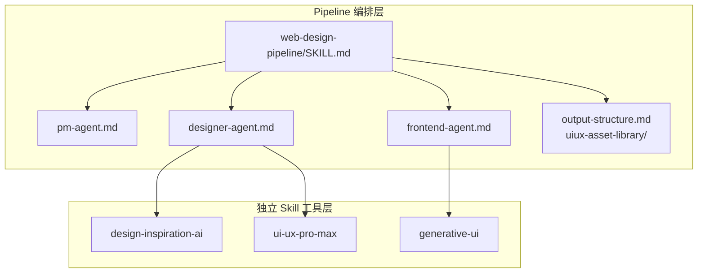
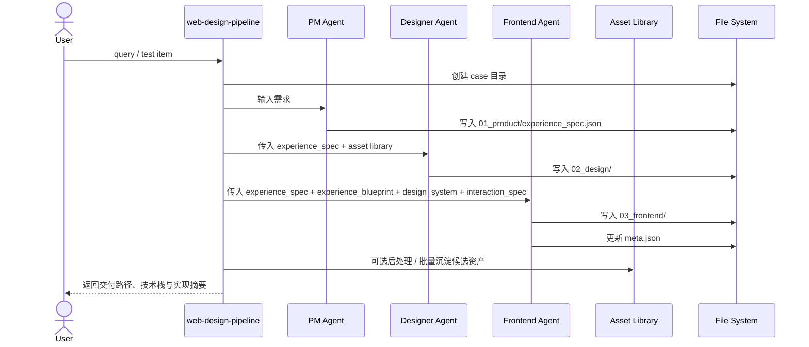

# Architecture

`UI Data Synth Pipeline` 的目标不是生成某一个固定网站，而是把“业务理解 -> 体验系统设计 -> 分层前端交付 -> 资产整理与沉淀”做成一条可复盘、可扩展、可对比版本的生产流水线。

这份文档描述的是当前仓库的真实架构：它包含 skill 工具层、pipeline 编排层、版本化 outputs，以及资产库与案例库之间的关系。

---

## 1. 系统定位

这个仓库本质上是三件东西的组合：

- **编排协议**：定义 PM、Designer、Frontend 三阶段如何协作
- **能力底座**：把设计灵感、UI/UX 收敛、生成式视觉等能力做成独立 skill
- **样例与证据库**：保留不同 pipeline 版本生成出的完整 case，便于回看、比较和评估

因此它不是传统意义上的“根目录启动型应用”。仓库根目录没有统一的 `package.json` 或 `src/`，真正可运行的前端入口通常位于某个 case 的 `03_frontend/`。

---

## 2. 顶层架构总览



### 关键理解

- `web-design-pipeline` 负责“串流程”
- 其他 skill 负责“提供专长能力”
- `outputs/` 保存每个 case 的完整结果
- `uiux-asset-library/` 保存可跨 case 复用的设计知识，而不是某个 case 的最终成品
- 资产沉淀更适合作为交付后的后处理或批处理阶段，而不是每次生成都同步执行

---

## 3. Skill 分层

仓库里的 skill 明确分成两层。

### 第一层：独立可复用 Skill

这些目录在任何上下文中都可以被单独调用：

- `designer/design-inspiration-ai`
- `designer/ui-ux-pro-max`
- `frontend/generative-ui`
- `skill-creator`

它们的职责是提供通用能力，例如趋势扫描、风格检索、设计系统收敛、Canvas/WebGL 视觉层实现等。

### 第二层：Pipeline 编排层

这些文件只在 `web-design-pipeline` 上下文中成立：

- `web-design-pipeline/SKILL.md`
- `web-design-pipeline/agents/pm-agent.md`
- `web-design-pipeline/agents/designer-agent.md`
- `web-design-pipeline/agents/frontend-agent.md`
- `web-design-pipeline/references/output-structure.md`
- `web-design-pipeline/references/uiux-asset-library/`

这一层不是“更多工具”，而是“如何组织工具”的规则。



---

## 4. 单个 Case 的数据流

每个 case 都沿着相同的顺序推进，不允许跳过上游规范直接生成最终代码。



### 阶段职责

| 阶段 | 读取 | 写入 | 目的 |
|------|------|------|------|
| PM | 原始需求 / 测试项 | `experience_spec.json` | 深度理解行业、业务与功能优先级，并输出 IA 与选型信号 |
| Designer | `experience_spec.json` + 资产库 | `experience_blueprint.json`、`design_system.json`、`interaction_spec.json` | 定义北极星体验、视觉语法并收敛成可实现规范；必要时产出候选资产素材 |
| Frontend | `experience_spec.json` + `experience_blueprint.json` + `design_system.json` + `interaction_spec.json` | 多文件源码、`tech_decision.json`、`self_review.json` | 把体验系统拆成多层并实现为真实前端 |

这里的关键区别是：

- 主生成链路默认到 `03_frontend/` 和 `self_review.json` 即可完成
- 资产沉淀不是每次都必须同步执行
- 更推荐在单 case 完成后手动整理，或在一批 case 完成后统一批处理

---

## 5. 当前标准输出模型

当前主规范以 `output-structure.md` 为准，推荐输出路径是：

```text
outputs/v3-pipeline/<case-id>/
├── meta.json
├── 01_product/
│   └── experience_spec.json
├── 02_design/
│   ├── experience_blueprint.json
│   ├── design_system.json
│   └── interaction_spec.json
└── 03_frontend/
    ├── package.json
    ├── tsconfig.json
    ├── README.md
    ├── tech_decision.json
    ├── self_review.json
    └── src/
```

### 当前标准的关键约束

- `03_frontend/` 默认是 **TypeScript + 多文件项目**
- 交付物应能通过 `npm install && npm run dev` 启动
- 组件、状态、交互和视觉层要分文件组织
- PM 要保留强行业理解和业务判断，但不再输出多份重复 narrative
- Designer 要先定义北极星体验和项目专属视觉语法，再定义系统细节
- Frontend 要先做体验分层和技术映射，再进入实现
- `meta.json` 需要记录 pipeline 版本、栈、视觉效果和交互完成度
- `uiux-asset-library/` 负责保存可以跨 case 复用的规律，而不是最终页面内容

### 为什么这很重要

早期仓库里存在大量单文件 `index.html` 样例，但那已经不再代表当前主规范。当前更强调：

- 组件化
- 类型安全
- 内部交互完整实现
- 可继续开发的工程结构

---

## 6. 运行模型

### 根目录运行方式

仓库根目录主要承担：

- skill 定义
- 文档说明
- case 归档
- 资产沉淀

它 **不是** 统一运行入口。

### Case 级运行方式

真正的运行入口通常在某个 case 下：

```text
outputs/v3-pipeline/<case-id>/03_frontend/
```

进入该目录后执行：

```bash
npm install
npm run dev
```

这意味着维护者在阅读仓库时，必须区分：

- “仓库架构”看根目录与 skill
- “前端运行”看具体 case

---

## 7. 资产库架构

`uiux-asset-library/` 是整个系统能持续变强的关键，因为它承担了“把案例经验抽象成知识”的角色。

但它现在不再只是一个按目录分类的 Markdown 文件夹，而是一套轻量可索引知识库。

当前结构建议为：

```text
uiux-asset-library/
├── catalog.json
├── asset-schema.md
├── templates/
│   └── asset-template.md
├── trend-notes/
├── style-recipes/
├── palette-strategies/
├── motion-patterns/
├── generative-recipes/
└── anti-patterns.md
```

其中：

- `catalog.json` 是统一索引入口，方便脚本、筛选、统计和后续建库
- `asset-schema.md` 定义统一字段模型
- 每条资产正文保留在 Markdown 中，但顶部使用统一 YAML frontmatter

资产类型仍按这几类组织：

- `trend-notes/`
- `style-recipes/`
- `palette-strategies/`
- `motion-patterns/`
- `generative-recipes/`
- `anti-patterns.md`

### 资产库的双重职责

- **给人读**：帮助设计师理解趋势、场景、边界和风险
- **给系统检索**：通过 frontmatter 和 `catalog.json` 映射到 `ui-ux-pro-max` 的 CSV 维度

因此资产不是“灵感随笔”，而应尽可能具备这些可检索字段：

- `asset_id`
- `asset_type`
- `title`
- `summary`
- `domains`
- `style_keywords`
- `interaction_level`
- `visual_primitives`
- `motion_primitives`
- `implementation_hints`
- `uiuxmax_domains`
- `suitable_stacks`
- `avoid_patterns`

### 为什么不把它完全塞回 CSV

因为这层资产承担的是高阶叙事与边界说明，例如：

- 趋势为什么成立
- 风格为什么适合某类产品
- 某种动态语言为什么不能滥用
- 一套 recipe 的适用场景、不适用场景和降级边界

这些信息很难被压扁成单行 CSV 而不损失判断力。

更合理的关系是：

- `ui-ux-pro-max/data/` 负责稳定、低歧义、结构化召回
- `uiux-asset-library/` 负责高阶规则、趋势、recipe 和反模式
- 成熟资产再逐步反哺回 `data/`

### 什么时候做资产沉淀

从 token 和主链路稳定性角度看，资产沉淀更适合：

- 单 case 完成后的手动整理
- 多 case 跑完后的批量抽取
- 只在确认“有可复用结论”时执行

不建议把它当作每次生成都同步执行的硬步骤。

---

## 8. 技术选型原则

当前架构下，技术选型不再在多个文件中重复定义，而是统一收口到：

- `web-design-pipeline/references/stack-selection-policy.md`

这里的架构文档只解释原则，不再作为栈规则真源。

### 选型目标

- 优先真实交互，而不是静态落版
- 优先视觉品质与业务贴合，而不是“最省事”
- 优先可维护、可扩展、可继续演进的工程结构
- 允许不同框架分流，但不允许回到模糊和随意
- 框架只是底盘，真正的特色来自体验分层、技术组合和项目专属视觉语法

### 当前架构理解

- 重交互产品界面通常落在 `React + TypeScript`
- SSR / SEO / 内容分发明确时切向 `Next.js`
- 极强动效和轻运行时诉求时可切向 `Svelte`
- `Vue` 和 `Astro` 是正式分支，但不是同权默认
- `html-tailwind` 只应视为历史阶段或极特殊例外

---

## 9. 版本演进与迁移状态

这个仓库的一个显著特点是：**架构演进本身就是仓库内容的一部分**。

### 路径迁移

存在从旧路径：

```text
outputs/<case-id>/
```

向版本化路径：

```text
outputs/v1-pipeline/<case-id>/
outputs/v2-pipeline/<case-id>/
outputs/v3-pipeline/<case-id>/
```

迁移的趋势。

### 前端交付迁移

也存在从：

- 单文件 `index.html`

迁移到：

- 多文件 TypeScript / 组件框架项目

的趋势。

### 可以把三代理解为

| 版本 | 核心特征 |
|------|----------|
| `v1` | 流程跑通优先，前端多为 `html-tailwind` 单文件交付 |
| `v2` | 增强设计探索与视觉策略，仍常见单文件交付 |
| `v3` | 多文件 TypeScript 项目成为主规范，强调完整交互与可运行性 |
| `vNext` | 保留 3-agent 外形，但 PM 强理解、轻文档；Designer 定义体验北极星；Frontend 做分层体验架构；主产物收敛为少量强规范文件 |

所以阅读仓库时，如果看到不同样式的 case，不一定是混乱，也可能是“演进证据仍然被保留”。

---

## 10. 维护入口

如果你要修改这个系统，通常对应的入口如下：

| 目标 | 修改位置 |
|------|----------|
| 调整整个流水线行为 | `web-design-pipeline/SKILL.md` |
| 改 PM / Designer / Frontend 某阶段策略 | `web-design-pipeline/agents/*.md` |
| 改输出目录与归档约束 | `web-design-pipeline/references/output-structure.md` |
| 改技术栈决策规则 | `web-design-pipeline/references/stack-selection-policy.md` |
| 增加或沉淀风格知识 | `web-design-pipeline/references/uiux-asset-library/` |
| 增加新的通用能力 | `.agents/skills/designer/` 或 `.agents/skills/frontend/` |
| 更新对外理解 | `README.md` 与 `ARCHITECTURE.md` |

---

## 11. 文档同步原则

这个仓库最容易失真的地方，是“样例已经进化了，但 README 和架构文档还停留在旧版本认知”。

因此建议在未来修改时保持同步：

1. 如果修改了前端交付规范，先更新 `output-structure.md`
2. 如果修改了技术选型规则，更新 `stack-selection-policy.md`
3. 如果修改了 pipeline 阶段职责，更新对应 `agents/*.md`
4. 如果修改了仓库的整体定位或主规范，再更新 `README.md` 和 `ARCHITECTURE.md`

否则读者会继续把历史样例误认成当前标准。
