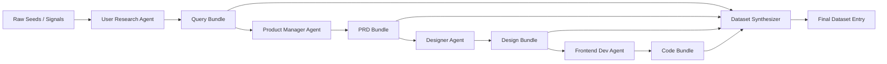
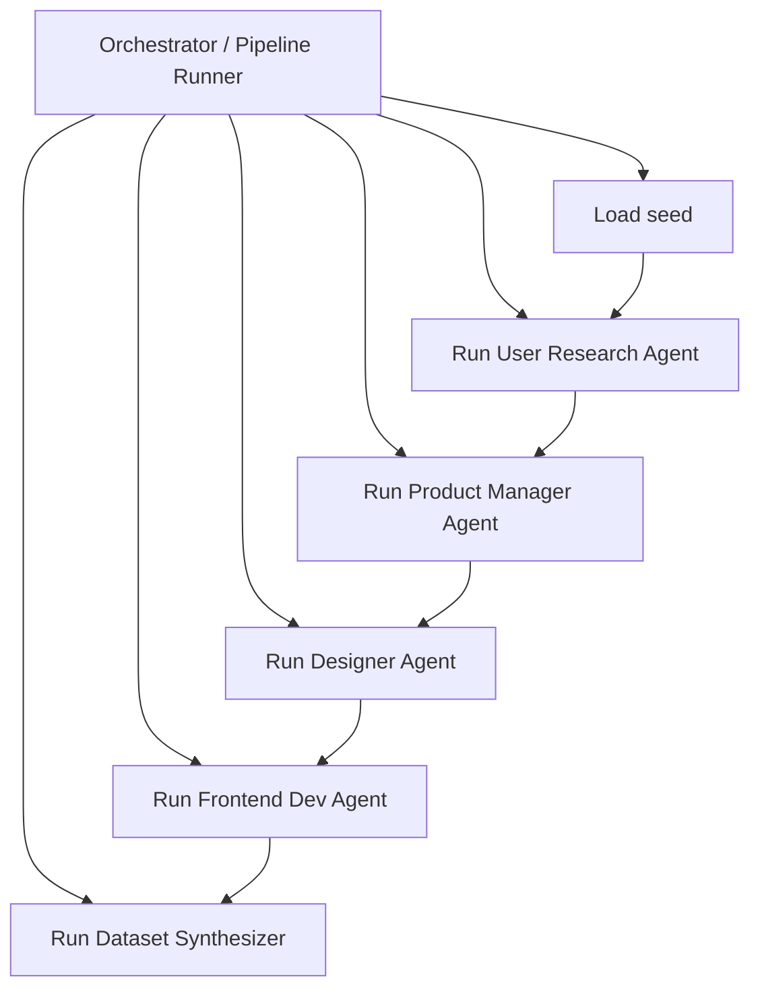

可以。
我建议你现在**先不要让 Claude 一次性生成“大而全系统”**，而是按 **“先定协议 -> 搭骨架 -> 实现 4 个 Agent -> 串起来 -> 产出样例”** 的节奏推进。
我下面给你的不是泛泛建议，而是**可以直接复制给 Claude Code 的分步 prompts**。
目标是：
- **只打通生成 + 数据合成主链**
- **先不做评估/QA/复杂调度**
- **尽量砍复杂度**
- **最终拿到一个清晰、可跑、可扩展的 MVP 项目**
---
# 一、先定 MVP 边界：奥卡姆剃刀版
先把范围砍到最小：
## 只做这些
1. 输入一批 `raw signals / seeds`
2. 用户研究 Agent 产出：
- query
- persona
- scenario
3. 产品经理 Agent 产出：
- PRD
- requirements/spec
4. 设计师 Agent 产出：
- design rationale
- design system
- component spec
5. 前端开发 Agent 产出：
- 一个可生成的前端项目代码包
6. 数据合成器产出：
- 最终 dataset entry
- 对话样本
- manifest
---
## 暂时不要做这些
- 不做自动评估
- 不做多模型路由
- 不做分布式队列
- 不做数据库
- 不做 Web 控制台
- 不做真实爬虫抓取
- 不做复杂工作流引擎
- 不做多目标技术栈支持
- 不做任意类型网站全覆盖
---
## 技术方案尽量简单
我建议 Claude 生成的项目先定成：
- **语言**：Python 3.11
- **CLI**：Typer
- **Schema**：Pydantic
- **模板**：Jinja2
- **配置**：YAML
- **存储**：本地文件系统
- **运行状态**：`runs/<run_id>/...`
- **目标前端栈**：先只支持
`Next.js + Tailwind + shadcn/ui 风格输出`
- **站点类型先只支持 2 类**
- `landing_page`
- `dashboard`
这是最稳的 MVP。
---
# 二、建议的最终项目目录结构
这是我建议你让 Claude 生成的**第一版目录结构**：
```text
ui-synth-pipeline/
├─ README.md
├─ CLAUDE.md
├─ pyproject.toml
├─ .env.example
├─ .gitignore
│
├─ docs/
│ ├─ architecture.md
│ ├─ data-flow.md
│ ├─ deliverables.md
│ ├─ runbook.md
│ └─ prompts-strategy.md
│
├─ configs/
│ ├─ pipeline.yaml
│ ├─ site-types.yaml
│ └─ defaults.yaml
│
├─ prompts/
│ ├─ runtime/
│ │ ├─ user_research.md
│ │ ├─ product_manager.md
│ │ ├─ designer.md
│ │ ├─ frontend_dev.md
│ │ └─ dataset_synthesizer.md
│ └─ skills/
│ ├─ synthesize_query.md
│ ├─ build_persona.md
│ ├─ build_scenario.md
│ ├─ write_prd.md
│ ├─ derive_design_rationale.md
│ ├─ derive_design_system.md
│ ├─ build_component_spec.md
│ ├─ plan_frontend_repo.md
│ ├─ generate_frontend_code.md
│ └─ assemble_dataset_entry.md
│
├─ src/
│ ├─ cli.py
│ ├─ main.py
│ │
│ ├─ core/
│ │ ├─ models.py
│ │ ├─ enums.py
│ │ ├─ paths.py
│ │ ├─ io.py
│ │ ├─ logger.py
│ │ ├─ settings.py
│ │ └─ prompt_loader.py
│ │
│ ├─ llm/
│ │ ├─ base.py
│ │ ├─ mock_client.py
│ │ └─ anthropic_client.py
│ │
│ ├─ agents/
│ │ ├─ base.py
│ │ ├─ user_research.py
│ │ ├─ product_manager.py
│ │ ├─ designer.py
│ │ ├─ frontend_dev.py
│ │ └─ dataset_synthesizer.py
│ │
│ ├─ orchestration/
│ │ ├─ pipeline.py
│ │ ├─ manifests.py
│ │ └─ run_context.py
│ │
│ ├─ templates/
│ │ ├─ next_landing/
│ │ └─ next_dashboard/
│ │
│ └─ storage/
│ ├─ artifact_store.py
│ └─ run_store.py
│
├─ examples/
│ ├─ seeds/
│ │ ├─ seed_001.json
│ │ ├─ seed_002.json
│ │ └─ seed_003.json
│ └─ expected/
│
├─ runs/
│ └─ .gitkeep
│
└─ tests/
├─ test_models.py
├─ test_pipeline_smoke.py
└─ test_artifact_store.py
```
---
# 三、最简数据流图
## 1）逻辑数据流

---
## 2）带编排器的视角

---
# 四、过程交付物清单
建议每个 run 目录长这样：
```text
runs/<run_id>/
├─ manifest.json
├─ 00_input/
│ └─ raw_seed.json
├─ 01_research/
│ ├─ query_bundle.json
│ ├─ persona.json
│ └─ scenario.json
├─ 02_product/
│ ├─ prd.md
│ ├─ requirements.json
│ └─ ia.json
├─ 03_design/
│ ├─ design_rationale.md
│ ├─ design_system.json
│ └─ component_spec.json
├─ 04_frontend/
│ ├─ repo_plan.json
│ ├─ app_spec.json
│ └─ generated_app/
├─ 05_dataset/
│ ├─ conversation.jsonl
│ ├─ dataset_entry.json
│ └─ sample_manifest.json
└─ logs/
└─ pipeline.log
```
---
## 每阶段输入输出对照表
| 阶段 | Agent | 输入 | 输出 |
|---|---|---|---|
| S0 | seed loader | raw seed | `raw_seed.json` |
| S1 | 用户研究 Agent | raw seed | `query_bundle.json`, `persona.json`, `scenario.json` |
| S2 | 产品经理 Agent | query/persona/scenario | `prd.md`, `requirements.json`, `ia.json` |
| S3 | 设计师 Agent | PRD + persona | `design_rationale.md`, `design_system.json`, `component_spec.json` |
| S4 | 前端开发 Agent | PRD + design bundle | `repo_plan.json`, `generated_app/` |
| S5 | 数据合成器 | 所有中间产物 | `conversation.jsonl`, `dataset_entry.json`, `sample_manifest.json` |
---
# 五、Claude Code 的生成节奏
不要一条 prompt 全干完。
建议你分 **7 步** 跑，每一步都让 Claude：
1. 先读当前仓库
2. 给出计划
3. 列出要改的文件
4. 再动手实现
5. 最后总结 changed files + next step
---
# 六、给 Claude Code 的“总控前置 Prompt”
这个建议你每次都附上，或者写进项目的 `CLAUDE.md`。
---
## Prompt 0：总控前置 Prompt
```text
你现在是这个项目的首席架构师 + 首席实现工程师。请帮助我用最小可行复杂度实现一个“高品质 UI 网站数据合成流水线”的 MVP。
目标：
- 先打通生成 + 数据合成流程
- 暂时不做评估/QA/复杂调度
- 用线性流水线实现：seed -> user research -> PM -> designer -> frontend -> dataset synthesis
- 项目必须结构清晰、易扩展、可运行、可读性强
强约束：
1. 遵循奥卡姆剃刀，优先最小方案，不要过度设计。
2. 不要引入数据库，不要引入消息队列，不要引入 Web 控制台，不要引入分布式系统。
3. 不做真实爬虫抓取，seed 输入先通过本地 JSON / Markdown 文件。
4. 所有阶段产物都落盘到 runs/<run_id>/ 目录。
5. 所有 Agent 输入输出必须有清晰的数据模型（推荐 Pydantic）。
6. 代码要模块化，但不要拆成微服务。
7. 当前先只支持两类站点：landing_page 和 dashboard。
8. 当前前端目标先只支持 Next.js + Tailwind 风格输出。
9. 每次实现时都先给出：
- 你的理解
- 实施计划
- 将创建/修改的文件清单
- 风险点
然后再开始修改代码。
10. 实现完成后，请输出：
- changed files
- 运行方式
- 当前完成度
- 下一步建议
代码与文档要求：
- Python 3.11
- Typer 做 CLI
- Pydantic 做 schema
- Jinja2 做模板
- YAML 做配置
- 所有 README / docs 要同步更新
- 项目必须带一个最小 smoke test
实现原则：
- contract-first
- file-based
- deterministic artifacts
- linear pipeline first
- later extensible
请在接下来的任务中严格遵守以上原则。
```
---
# 七、分步 Prompt 套装
下面是建议你按顺序喂给 Claude Code 的 prompts。
---
## Step 1：先搭项目骨架和架构文档
```text
基于我们已经约定的 MVP 范围，请先完成“项目骨架 + 架构文档”，暂时不要实现完整业务逻辑。
本步目标：
1. 创建清晰的项目目录结构
2. 创建核心文档：
- README.md
- docs/architecture.md
- docs/data-flow.md
- docs/deliverables.md
- docs/runbook.md
3. 创建基础文件：
- pyproject.toml
- .env.example
- .gitignore
- CLAUDE.md
4. 创建 src/ 下的空模块骨架与必要的 __init__ / stubs
5. 创建 examples/seeds/ 下的 2~3 个示例 seed
6. 创建 runs/.gitkeep
强约束：
- 只搭骨架，不要写太多复杂逻辑
- 目录结构要服务于线性流水线
- 文档中明确每个 Agent 的输入/输出产物
- 文档中明确最终 run 目录结构
- 文档里同时给出 ASCII 或 Mermaid 数据流图
额外要求：
- README 要说明这个项目当前只做 generation + data synthesis，不做 evaluation
- architecture.md 要说明为什么当前不用数据库、消息队列、微服务
- deliverables.md 要按阶段列出 artifact 清单
请先输出计划与文件清单，再开始创建文件。
```
---
## Step 2：实现核心数据模型、路径管理、artifact store、CLI 骨架
```text
请在当前骨架基础上，实现项目的核心基础设施，重点是“数据契约先行”。
本步目标：
1. 在 src/core/models.py 中定义核心 Pydantic models：
- RawSeed
- QueryBundle
- PersonaProfile
- ScenarioProfile
- PRDArtifact
- RequirementsArtifact
- IAArtifact
- DesignRationaleArtifact
- DesignSystemArtifact
- ComponentSpecArtifact
- RepoPlanArtifact
- FrontendCodeArtifact
- DatasetEntry
- RunManifest
2. 在 src/core/paths.py 中统一定义 runs/<run_id>/ 各阶段目录路径
3. 在 src/storage/artifact_store.py 中实现文件落盘/读取能力
4. 在 src/orchestration/run_context.py 中实现 RunContext
5. 在 src/cli.py 中实现最小 CLI：
- new-run
- inspect-run
- run-pipeline
6. 添加 tests/test_models.py 和 tests/test_artifact_store.py
7. 更新 README 中的 CLI 用法
强约束：
- 所有 artifact 必须可 JSON 序列化
- 所有阶段输出路径必须固定、可预测
- 先不要实现复杂 orchestration，只做基础能力
- 不要引入数据库
- 不要把 prompt 文本硬编码到 agent 文件里，保留 prompt_loader 钩子
请先输出：
- 数据模型清单
- 文件清单
- CLI 设计
然后再开始实现。
```
---
## Step 3：实现用户研究 Agent
```text
请实现 User Research Agent，使其能从本地 seed 文件生成：
- query bundle
- persona
- scenario
本步目标：
1. 实现 src/agents/user_research.py
2. 实现相关 prompt 文件：
- prompts/runtime/user_research.md
- prompts/skills/synthesize_query.md
- prompts/skills/build_persona.md
- prompts/skills/build_scenario.md
3. 支持输入：
- examples/seeds/*.json
4. 产出：
- runs/<run_id>/01_research/query_bundle.json
- runs/<run_id>/01_research/persona.json
- runs/<run_id>/01_research/scenario.json
5. 在 agent 中实现清晰的方法：
- synthesize_query(...)
- build_persona(...)
- build_scenario(...)
6. 提供一个 mock LLM mode，保证没有真实 API key 时也能跑通 smoke flow
7. 添加最小测试或示例调用
设计要求：
- query bundle 至少包含：
- normalized_query
- site_type
- domain
- target_user
- feature_hints
- constraints
- persona 至少包含：
- name
- role
- goals
- frustrations
- design_sensitivity
- tech_level
- scenario 至少包含：
- use_context
- core_task
- success_criteria
- constraints
强约束：
- 当前先不做真实网络采集
- 只做本地 seed -> research bundle
- 输出 JSON 必须稳定
- prompt 要清晰写明输出 schema
请先输出：
- User Research Agent 的类设计
- 输入输出 schema 摘要
- 将新增/修改的文件
再开始实现。
```
---
## Step 4：实现产品经理 Agent
```text
请实现 Product Manager Agent，使其基于 research 阶段产物生成：
- PRD
- requirements
- information architecture
本步目标：
1. 实现 src/agents/product_manager.py
2. 实现 prompt 文件：
- prompts/runtime/product_manager.md
- prompts/skills/write_prd.md
3. 产出：
- runs/<run_id>/02_product/prd.md
- runs/<run_id>/02_product/requirements.json
- runs/<run_id>/02_product/ia.json
4. Product Manager Agent 至少实现：
- analyze_requirements(...)
- write_prd(...)
- build_information_architecture(...)
5. PRD 需要覆盖：
- product summary
- target audience
- problem statement
- goals / non-goals
- core features
- user flows
- edge cases
- acceptance criteria
6. requirements.json 要比 prd 更结构化
7. ia.json 要给出页面/section/component 层级
强约束：
- PRD 不要写得像空泛作文，要可执行
- requirements 必须结构化
- IA 必须服务于后续 design 和 frontend
- 不要引入太复杂的 PM 框架，保持简洁
请先输出：
- PM Agent 方法设计
- PRD / requirements / IA 的 schema 设计
- 文件修改计划
再开始实现。
```
---
## Step 5：实现设计师 Agent
```text
请实现 Designer Agent，使其基于 PRD + persona + query 生成：
- design rationale
- design system
- component spec
本步目标：
1. 实现 src/agents/designer.py
2. 实现 prompt 文件：
- prompts/runtime/designer.md
- prompts/skills/derive_design_rationale.md
- prompts/skills/derive_design_system.md
- prompts/skills/build_component_spec.md
3. 产出：
- runs/<run_id>/03_design/design_rationale.md
- runs/<run_id>/03_design/design_system.json
- runs/<run_id>/03_design/component_spec.json
4. Designer Agent 至少实现：
- derive_design_rationale(...)
- derive_design_system(...)
- build_component_spec(...)
5. design_system.json 至少包含：
- color palette
- typography
- spacing scale
- radius
- shadows
- motion hints
6. component_spec.json 至少包含：
- page sections
- core components
- variants
- states
- responsive rules
强约束：
- 当前不要做真正图片/线框图生成
- 输出必须是“可供前端编码”的设计规范
- 风格要服务于 persona 和场景，不要只是列 token
- 先支持 landing_page 和 dashboard 两种 archetype
请先输出：
- Designer Agent 的内部方法
- 设计产物 schema 摘要
- 文件改动计划
再开始实现。
```
---
## Step 6：实现前端开发 Agent
```text
请实现 Frontend Dev Agent，使其基于 product + design 产物生成前端项目代码包。
本步目标：
1. 实现 src/agents/frontend_dev.py
2. 实现 prompt 文件：
- prompts/runtime/frontend_dev.md
- prompts/skills/plan_frontend_repo.md
- prompts/skills/generate_frontend_code.md
3. 在 src/templates/ 下提供两个最小模板骨架：
- next_landing/
- next_dashboard/
4. Frontend Dev Agent 至少实现：
- plan_repo(...)
- generate_code(...)
5. 产出：
- runs/<run_id>/04_frontend/repo_plan.json
- runs/<run_id>/04_frontend/app_spec.json
- runs/<run_id>/04_frontend/generated_app/...
6. 当前生成的前端项目要求：
- Next.js App Router 风格
- Tailwind 风格类名
- 组件结构清晰
- 可被后续人工接管继续开发
7. repo_plan.json 至少包含：
- target stack
- file tree
- main components
- pages/sections
- state/data assumptions
强约束：
- 不要做复杂 AST 变换器
- 先用“模板 + LLM填充”的方式生成代码
- 只支持 landing_page / dashboard
- 代码要尽量模块化，不要所有内容塞一个 page.tsx
- 先不做真实构建验证，但目录和文件要尽可能合理
请先输出：
- Frontend Agent 的设计
- 模板策略
- 文件清单
再开始实现。
```
---
## Step 7：实现 Orchestrator + Dataset Synthesizer，串通全链路
```text
请把前面的模块串起来，实现一条完整的线性流水线，并生成最终 dataset entry。
本步目标：
1. 实现 src/orchestration/pipeline.py
2. 实现 src/agents/dataset_synthesizer.py
3. 实现 prompt 文件：
- prompts/runtime/dataset_synthesizer.md
- prompts/skills/assemble_dataset_entry.md
4. 完成 run-pipeline 命令，使其可以：
- 读取一个 seed
- 运行 user research agent
- 运行 PM agent
- 运行 designer agent
- 运行 frontend dev agent
- 运行 dataset synthesizer
5. 产出：
- runs/<run_id>/manifest.json
- runs/<run_id>/05_dataset/conversation.jsonl
- runs/<run_id>/05_dataset/dataset_entry.json
- runs/<run_id>/05_dataset/sample_manifest.json
6. Dataset Synthesizer 要把中间产物组织成一条可训练样本，至少包含：
- input seed
- final query
- reasoning artifacts summary
- PRD path
- design artifact paths
- code artifact path
- one-turn or multi-turn conversation sample
conversation.jsonl 最小先支持两种形式：
- direct generation
- clarification style
强约束：
- 先做线性 pipeline，不要引入异步图调度
- manifest 要记录每个阶段的输入输出路径
- pipeline 出错时至少要有清晰日志
- 数据合成先以“文件引用 + 摘要”方式组织，不要把所有大文件内联进一个 JSON
请先输出：
- pipeline 设计
- manifest 结构
- dataset entry 结构
- 文件清单
然后开始实现。
```
---
## Step 8：补示例、运行说明、smoke test
```text
请对当前项目做一次最小可运行收尾，重点是“别人拉下来就知道怎么跑”。
本步目标：
1. 补全 README 的 Quick Start
2. 补全 docs/runbook.md
3. 添加至少一个完整的 smoke test
4. 补充 examples/seeds/ 的示例说明
5. 如果当前支持 mock LLM mode，请在 README 明确演示如何使用 mock 模式跑通整条 pipeline
6. 输出一次建议的 demo run 命令
7. 检查 docs 和代码是否一致
8. 检查是否存在明显过度设计并做必要删减
请特别做一次“复杂度审计”：
- 列出当前项目里哪些地方可能过度设计
- 如果能删减，请直接删减
- 保持 MVP 可用前提下，去掉非必要层级
最后请输出：
- 当前项目最终目录树
- 如何运行 demo
- 还未实现但故意留到下一阶段的内容
```
---
# 八、一个“纠偏 Prompt”，防止 Claude 越做越复杂
你在第 4 步以后很可能会遇到 Claude 开始加很多不必要东西。
这时候直接用这个：
```text
请停止扩展复杂度，回到 MVP 原则。
请审查当前项目，删除或收缩以下内容：
- 不必要的抽象层
- 没有被实际使用的接口
- 过度泛化的 provider/router/factory
- 当前阶段不会用到的数据库/异步/并发/分布式设计
- 没有进入主链路的模块
- 不必要的 site types / tech stack options
要求：
1. 保留当前线性主链路：seed -> research -> PM -> design -> frontend -> dataset
2. 保留清晰的数据契约与 artifact store
3. 保留 mock mode
4. 保留 README / docs 一致性
5. 删除一切“以后可能有用但现在没用”的复杂设计
请先列出：
- 你判断的冗余点
- 计划删除/收缩的文件
然后再执行。
```
---
# 九、如果你想“一口气生成”，我给你一个总 Prompt
不推荐，但可以作为一次性尝试。
```text
请在当前仓库中实现一个最小可行的“高品质 UI 网站数据合成流水线”项目，目标是打通：
seed -> user research agent -> product manager agent -> designer agent -> frontend dev agent -> dataset synthesizer
范围要求：
- 只做 generation + data synthesis
- 暂时不做 evaluation / QA
- 不做真实抓取，seed 来自本地 examples/seeds/
- 不做数据库，不做 Web UI，不做消息队列，不做分布式
- 所有中间产物落盘到 runs/<run_id>/
- 用 Python 3.11 + Typer + Pydantic + Jinja2 + YAML
- 前端输出只支持 Next.js + Tailwind 风格
- 站点类型只支持 landing_page 和 dashboard
请完成：
1. 项目目录骨架
2. README / architecture / data-flow / deliverables / runbook 文档
3. 核心 schema / artifact store / run context / CLI
4. User Research Agent
5. Product Manager Agent
6. Designer Agent
7. Frontend Dev Agent
8. Dataset Synthesizer
9. 线性 Orchestrator / pipeline runner
10. examples seeds
11. smoke test
严格要求：
- 先输出你的实现计划、文件结构、阶段划分
- 然后分阶段实现，不要一次性乱写
- 每一阶段结束时输出 changed files 和下一阶段计划
- 遵循奥卡姆剃刀，避免过度设计
- 文档与代码必须同步
- 项目最终应当可通过 mock LLM mode 跑通一条示例流水线
最终请输出：
- 完整目录树
- demo 命令
- 一个 run 的预期产物清单
```
---
# 十、我建议你实际怎么用
我的建议非常直接：
## 最佳执行顺序
1. 先发 **Prompt 0**
2. 再依次发 **Step 1 ~ Step 8**
3. 中间如果 Claude 开始发散，插入 **纠偏 Prompt**
4. 不要一口气跑总 Prompt，除非你就是想赌一次大生成
---
# 十一、建议你给 Claude 额外加的执行习惯
每一步都要求 Claude：
```text
在开始修改前，先输出：
1. 你的理解
2. 本步不做什么
3. 文件变更列表
4. 你打算如何保证不引入过度设计
```
在完成后输出：
```text
1. changed files
2. 运行命令
3. 当前可验证结果
4. 下一步建议
```
这会明显提高项目成型质量。
---
# 十二、最后我帮你再收一遍：这版 MVP 的核心架构
## 最小系统角色
- User Research Agent
- Product Manager Agent
- Designer Agent
- Frontend Dev Agent
- Dataset Synthesizer
- 一个线性 Pipeline Runner
## 最小项目能力
- 本地 seed 输入
- 结构化 artifact 输出
- 前端代码包生成
- 对话样本合成
- 可重复运行的 run 目录
## 最小成功标准
- 能从 `examples/seeds/*.json` 跑出一条完整样本
- 中间产物全部落盘
- 代码结构清晰
- README 可指导别人跑通
---
如果你愿意，我下一条可以继续直接给你两样很实用的东西之一：
### A. **每个 runtime agent 的 prompt 模板正文**
也就是：
- `prompts/runtime/user_research.md`
- `prompts/runtime/product_manager.md`
- `prompts/runtime/designer.md`
- `prompts/runtime/frontend_dev.md`
- `prompts/runtime/dataset_synthesizer.md`
### B. **核心 Pydantic schema 初稿**
我直接把 `models.py` 该怎么定义给你写出来。
如果你要，我建议下一步我直接给你：
**“runtime agent prompts + models.py 初稿”**。